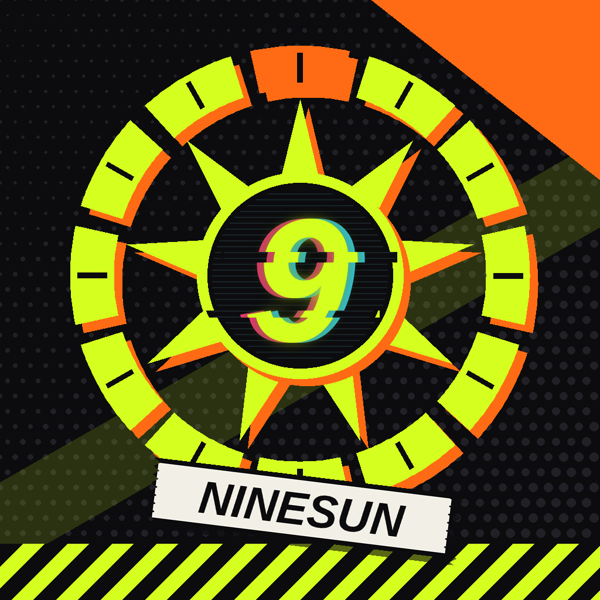

# NineSun

一個**從零打造**的 iOS AI 夥伴，絕區零風格的街頭霓虹介面。它的底層認知就是 **九型十二宮**（Nine & Twelve，取自 [`claude/hollow-ipa`](../../tree/claude/hollow-ipa) 分支的 Hollow App），並且精通 **八字、紫微斗數、易經卜卦**。它會說 **繁體中文、English、Español、Italiano**。

- 神經網路、反向傳播、優化器、分詞器、推理引擎：**全部手寫**，沒有用 PyTorch／TensorFlow／Core ML，也沒有任何預訓練權重。
- **完全免費**：不呼叫任何付費 API。模型在手機上運行；只有本地不會的問題才上網查（DuckDuckGo／Bing／維基百科，不需要金鑰）。
- 使用者的話就是法律：規則由程式碼在**每一則**回覆上強制執行，不依賴模型記憶。

---

## 認知架構

```
 用戶訊息（自動判斷語言：zh / en / es / it）
    │
    ▼
 ① 規則引擎  ── 使用者規則優先（稱呼、改名、簡短、句尾、禁詞、觸發回覆）
    │
    ▼
 ② 十二宮感知 PalaceCore ── 每一句話先被對應到十二宮之一，累積成「命主畫像」（演化記憶）
    │
    ▼
 ③ 意圖路由 ─┬─ 追問：「為什麼」「怎麼辦」「再多說一點」（記得上一則解讀）
             ├─ 主題問句：「我今年感情運如何」→ 本命第 5 宮 + 大運第 5 方面 + 流年引動 + 流月
             ├─ 九型十二宮：流日（白天／夜裡）、流月、流年、大運（含十二方面）、命盤、合盤，可問明天、指定日期
             ├─ 八字：節氣定柱、藏干、十神、月令格局、身強弱、喜忌、沖合刑害、神煞；流年（為什麼好／壞）、流月、流日、大運、主題、合婚
             ├─ 紫微斗數：命身宮、五行局、十四主星、輔星、本命四化、三方四正與格局、大限、流年命宮與流年四化、流月（斗君）、宮位主題
             ├─ 易經：三錢法、梅花易數、本卦／變卦／互卦
             ├─ 資料庫（中文 236 條，含格局、組合、神煞）→ 本地不會就上網查，整理成答案並附來源
             └─ 工具：計算機、時鐘
    │
    ▼
 ④ 解讀層 Reader ── 把引擎算出的事實寫成人話（措辭隨日期與宮位輪替，四種語言）
    │            └─ 八字／紫微／易經：由手寫 Transformer 把事實框說成白話，
    │               並做自我核對（宮位、數字必須和引擎一致、不能口吃），不合就改用引擎原文
    ▼
 ⑤ 一般聊天 ── 陪伴層（寒暄、情緒接回今天的日宮夜宮）→ 手寫對話庫檢索 → 宮位感知回覆 → 老實說不會
    │
    ▼
 ⑥ 規則強制執行 → 回覆
```

- **為什麼聊天不用神經網路直接生成？** 約 400 萬參數、只在 CPU 上訓練的小模型，能把「事實框」翻成白話（範圍固定，有核對），但沒辦法穩定地閒聊。所以聊天改用手寫對話庫檢索（`ai/chat_bank.py`，可隨時擴充，不用重訓），沒有把握就直說不會，不亂編。
- **演化**：對回覆按 👍／👎 會調整 NineSun 之後挑哪一種說法；說「記住：加班屬於6宮」可以教它新的十二宮詞彙；每句話都會累積成十二宮畫像。
- **混合分詞器**：中文逐字，英文／西班牙文／義大利文的常用字整字成為一個 token，其他字母逐字退回。Python 與 Swift 用同一個正規式，由測試保證逐位一致。
- **Python 與 Swift 逐字一致**：所有引擎、事實框、四語模板、分詞、感知都由單元測試對照 Python 產生的 fixture。

## 圖示



九道光芒的太陽代表九型，外圈十二段警示環代表十二宮，中央是故障錯位的「9」，下方是 NINESUN 膠帶標籤（`ios/tools/make_icon.py` 產生）。

## 目錄

```
ai/                          訓練端（Python + NumPy）
  echo_model.py              Transformer、手推反向傳播、AdamW、混合分詞器
  ninetwelve.py              九型十二宮引擎（Hollow 算法）
  astro.py chinese_cal.py    太陽黃經、節氣、朔望、農曆
  bazi.py ziwei.py iching.py 八字、紫微斗數、易經
  i18n*.py                   英／西／義 文字、模板、對話
  *_corpus.py palace_core.py 訓練語料與十二宮感知
  train.py evaluate.py       訓練、匯出、評估
ios/
  EchoCore/                  Swift Package：推理、分詞、所有引擎、路由、規則、模板（附測試）
  NineSun/                   SwiftUI App
  project.yml                XcodeGen 設定
.github/workflows/build-ninesun-ipa.yml   macOS：測試 → 建置 → 未簽名 IPA → Release
```

## 重新訓練

```sh
pip install numpy numexpr
python3 ai/train.py --steps 5500 --batch 16 --lr 1.5e-3
python3 ai/evaluate.py
```

訓練會一併匯出 `ios/NineSun/Resources/` 的權重與測試用的 `Fixtures/reference.json`，提交後 CI 會產生新的 IPA。

## 安裝 IPA

每次推送都會觸發 GitHub Actions，先跑 Swift 測試，再建置**未簽名**的 `NineSun.ipa`，發佈在 Releases（`ninesun-build-N`）。

用 **Sideloadly、AltStore 或 TrollStore** 以自己的 Apple ID 簽名安裝。免費 Apple ID 簽的 App 通常每 7 天要重簽一次。

## 限制（老實說）

NineSun 的神經網路只有約 400 萬參數，只在 CPU 上訓練，**不可能**達到 Claude Fable／Opus 這類大型模型的通用智慧；要那種程度就得用付費 API，而這個專案刻意不用。它的「聰明」來自設計：

- 命理推算全部交給精確的符號引擎，所以命盤數字不會亂編；
- 解讀層把結果寫成有條理的人話，並能依你的九型十二宮回答主題問題與追問；
- 日常聊天用手寫對話庫；沒學過的知識題會上網搜尋，把找到的內容整理後附上來源，而不是瞎猜。

它能聊的範圍仍然有限（對話庫目前約 260 組問答）。想讓它聊得更廣，就擴充 `ai/chat_bank.py`——不需要重新訓練。

> 粉絲向非官方作品，與 miHoYo / HoYoverse 無關。NineSun 與其世界觀皆為原創。命理內容僅供娛樂與自我覺察參考。
